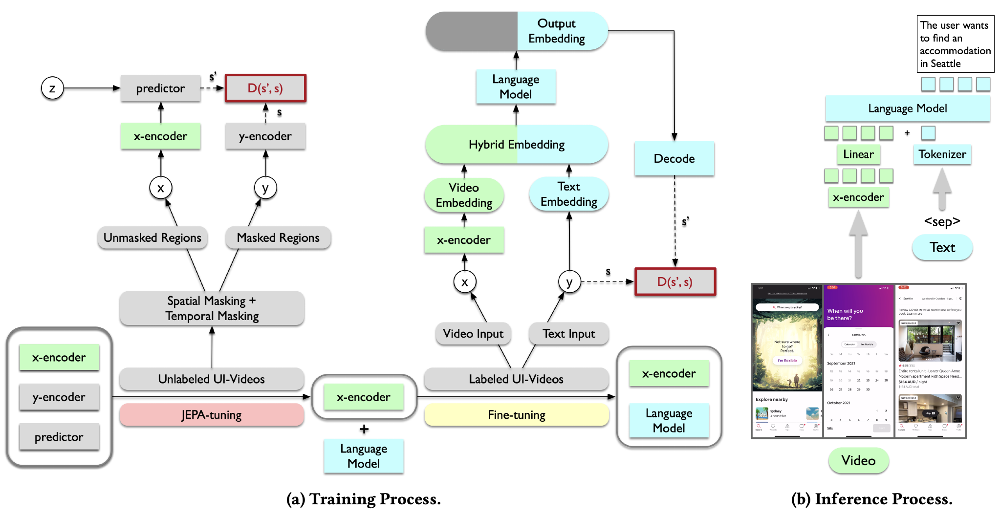

# UI-JEPA: Towards Active Perception of User Intent through Onscreen User Activity
<div>

This repository releases the dataset created as part of the UI-JEPA project, to push the boundaries of UI Understanding.

- **UI-JEPA**: [`UI-JEPA: Towards Active Perception of User Intent through Onscreen User Activity`](https://arxiv.org/abs/2409.04081) [[`BibTeX`](#citation)]<br>
  Yicheng Fu, Raviteja Anantha, Prabal Vashisht, Jianpeng Cheng, Etai Littwin

## Overview of UI-JEPA
Our contributions in the paper are highlighted below,
* __Benchmarks__: We introduce two new benchmarks, Intent in the Wild (IIW) and Intent in the Tame (IIT) for UI Understanding. The task is to generate a natural language description of user intent given a recording of UI interactions. The dataset is released in this reposiotry.
* __Framework__: We propose UI-JEPA, a novel framework that employs various masking strategies to learn abstract UI embeddings from unlabeled data through SSL.
* __Model__: We present a lightweight JEPA-tuned MLLM (JEPA-based video encoder + fine-tuned auto-regressive head) designed to generate user intent from UI action sequences, showcasing the integration of JEPA with LLM decoders for user intent prediction. The models are **NOT** released as a part of this repository.
* __Comparison__: We compare our lightweight model against state-of-the-art MLLMs, demonstrating that our approach achieves parity while using only a fraction of the data, time, and computational resources.



## Dataset
As a part of our work, we are releasing two benchmarks, Intent in the Wild (IIW) and Intent in the Tame (IIT) for UI Understanding.
### Intent in the Tame (IIT)
In its first version, IIT dataset consists of 914 labeled videos spanning across 10 intent categories (e.g. sending message, calling a person, etc.). The data is structured as follows,
```
- train/
- val/
- test/
```
Each directory has `.mov` recordings along with `annotations.csv`.

### Intent in the Wild (IIW)
The IIW dataset consists of 219 intent categories, with 135 in the few-shot split and 84 in the zero-shot split. In total, the dataset contains 1.6K videos, each averaging 749 frames and approximately ∼25 seconds in duration. The data is structured as follows,
```
- train/
- val/
- test/
```
Each directory has `.mov` recordings along with `annotations.csv`.

## Accessing the Dataset
You can access and download the dataset using one of the following methods:

### 🔗 Direct Download
- [IIT](https://ml-site.cdn-apple.com/datasets/ui-jepa/iit-1.0.0/data/raw.zip)
- [IIW](https://ml-site.cdn-apple.com/datasets/ui-jepa/iiw-1.0.0/data/raw.zip)

Unzip it using:
```bash
unzip raw.zip
```

### Using python
Clone the repository, create a python virtual environment and install `requests` module,
```bash
python -m venv venv
source venv/bin/activate
pip install requests
```
Run the `dataset_download.py` as follows,
```bash
python dataset_download.py --type [iit/iiw] --output_dir [output directory]
```
Unzip the file using bash.

## License
This project's code is released under the Apple Sample Code License (see [LICENSE](LICENSE)). This project's data is released under the CC-BY-NC-ND license (see [LICENSE_DATA](LICENSE_DATA)).

## Citation
If you find our work useful, please consider citing us as:
```bibtex
@inproceedings{10.1145/3699682.3728327,
author = {Fu, Yicheng and Anantha, Raviteja and Vashisht, Prabal and Cheng, Jianpeng and Littwin, Etai},
title = {UI-JEPA: Towards Active Perception of User Intent through Onscreen User Activity},
year = {2025},
isbn = {9798400713132},
publisher = {Association for Computing Machinery},
address = {New York, NY, USA},
url = {https://doi.org/10.1145/3699682.3728327},
doi = {10.1145/3699682.3728327},
booktitle = {Proceedings of the 33rd ACM Conference on User Modeling, Adaptation and Personalization},
location = {New York City, NY, USA},
series = {UMAP '25}
note = {Accepted for publication}
}
```
